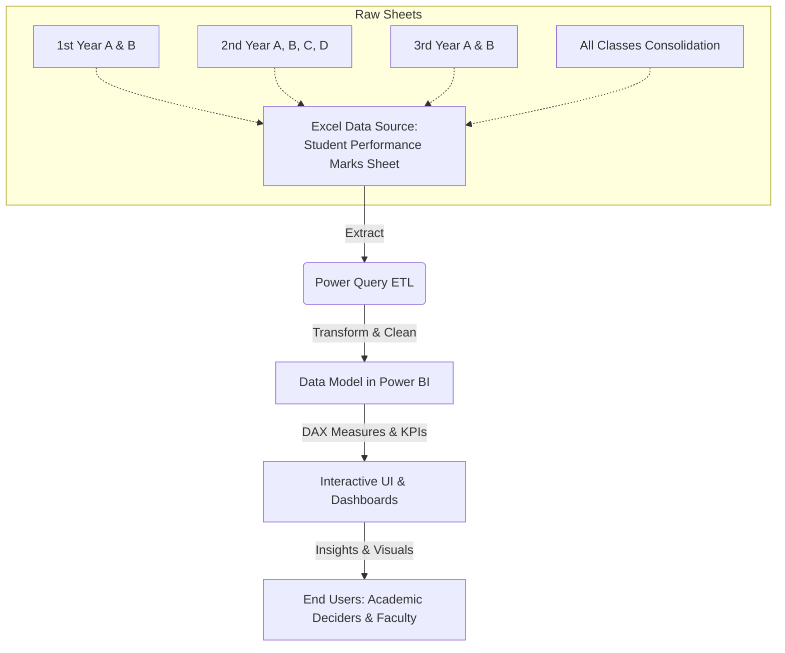

# 📊 Student Performance Analytics Dashboard

An interactive and comprehensive data analytics solution built using **Microsoft Power BI** and **Excel** to monitor, analyze, and evaluate student academic performance across multiple years (1st, 2nd, and 3rd Year) and sections (A, B, C, D).

---

## 🎯 Problem Statement

In traditional educational administration, tracking and evaluating student academic metrics across various cohorts often suffers from several challenges:
* **Siloed and Fragmented Data:** Student assessment marks are typically maintained across multiple disjointed Excel sheets or paper grading lists, making cross-sectional analysis difficult.
* **Lack of Real-Time Insights:** Faculty and administrators cannot easily visualize continuous assessment trends (CIA-1, CIA-2, CIA-3) over time to see if average grades are improving or declining.
* **Delayed Interventions:** Underperforming or borderline students are often only identified at the end of the academic term after final grades are computed, when it is already too late for corrective mentoring.
* **Invisible Correlation Factors:** Qualitative variables, such as classroom participation, are rarely evaluated visually alongside numerical exam scores to understand their direct impact on final outcomes.

---

## 💡 The Solution

This project implements a centralized, interactive **Power BI analytics dashboard** integrated with a structured **Excel data repository**. 
* **Unified Academic Dashboard:** Consolidates data from all student classes (1st, 2nd, and 3rd Year batches) into one source of truth.
* **Early Warning Indicators:** Highlights student grades dynamically and isolates students performing below the passing threshold using conditional visual highlights.
* **Dynamic Slicing & Cohorts:** Empowers educators to isolate analysis by specific years, sections, or grade brackets (e.g., Distinction, First Class, Second Class).
* **Correlation Modeling:** Visually maps internal assessment scores alongside participation points to prove the impact of active class engagement.

---

## 🔒 Ethics & Data Sensitivity

Academic data is highly sensitive and carries strict ethical responsibilities. 
* **Privacy & PII (Personally Identifiable Information):** Registration numbers, student names, and individual marks are private records. Showing this information publicly without explicit consent is unethical and violates privacy regulations (such as FERPA or GDPR-like guidelines).
* **Mitigation Strategies Implemented:**
  > [!WARNING]
  > **Public Sharing Rules:** Ensure that any `.xlsx` data source containing real names and actual identifiers is added to your `.gitignore` file so it is never pushed to public repositories.
  > 
  > **Data Anonymization:** For public portfolios, live demos, or GitHub uploads, all student names and registration numbers must be anonymized or replaced with synthetic mock data (e.g., *Student 1*, *REG001*). 
  > 
  > **Role-Based Security:** In production deployments, administrators should implement Row-Level Security (RLS) within Power BI to restrict view access, ensuring that instructors can only view their own class records, and students cannot see their peers' data.

---

## 🛠️ Methodology & Data Flow

This project follows a systematic business intelligence lifecycle:

### 1. Data Collection & Preprocessing
* Consolidated historical records of academic sections into formatted Excel worksheets (`1st Year`, `2nd Year`, `3rd Year`).
* Cleaned headers, aligned data formats, and structured the schema.

### 2. ETL (Extract, Transform, Load)
* Leveraged **Power Query** to extract tables from Microsoft Excel.
* Cleaned and normalized text cases, handled missing scores, and appended sheets into a unified `All Classes` dataset.

### 3. Data Modeling & DAX Calculation
* Modeled the consolidated data inside Power BI Desktop.
* Created calculated columns and DAX measures to compute:
  * **Total Score:** $\text{Total} = \text{CIA-1} + \text{CIA-2} + \text{CIA-3} + \text{Participation}$
  * **Result Class:** Categorization into *First Class with Distinction*, *First Class*, *Second Class*, or *Fail* based on standard score thresholds.
  * **Class Counts & Rates:** Dynamic measurements for student counts and pass/fail percentages.

### 4. Interactive Visualization
* Designed an executive summary view (highlighting overall distributions, class trends, and semester progressions) and a deep-dive tabular lookup screen containing sparklines and detailed score breakdowns.

---

## 🛠️ Data Pipeline & Architecture

The following diagram illustrates how raw academic assessment data is processed, modeled, and visualized:

---

## 📋 Data Schema & Workbook Structure

The source data `Student Performance Marks Sheet.xlsx` contains multiple sheets categorized by academic year and section, as well as a consolidated sheet. Each sheet follows a consistent relational schema:

| Column Name | Data Type | Description |
| :--- | :--- | :--- |
| **S.No.** | Integer | Sequential identifier row index. |
| **Reg. Number** | Text/Alphanumeric | Unique registration identifier for each student. |
| **Name** | Text | The full name of the student. |
| **CIA-1** | Decimal/Integer | Continuous Internal Assessment 1 marks. |
| **CIA-2** | Decimal/Integer | Continuous Internal Assessment 2 marks. |
| **CIA-3** | Decimal/Integer | Continuous Internal Assessment 3 marks. |
| **Participation Marks** | Decimal/Integer | Subjective marks assigned based on active classroom participation. |
| **Total** | Decimal/Integer | Aggregated score (CIA-1 + CIA-2 + CIA-3 + Participation). |
| **Pass / Fail** | Text (Pass/Fail) | Evaluative status indicating whether the student met the passing threshold. |

---

## 💡 Key Features & Analytics Dashboards

The Power BI dashboard (**`Student Performance Analytics Dashboard.pbix`**) is designed to deliver key performance insights across multiple levels:

### 1. Cohort Performance Comparison
*   Filter, sort, and slice information dynamically by **Academic Year** (1st, 2nd, 3rd) and **Sections** (A, B, C, D).
*   Compare class averages side-by-side to understand resource and curriculum effectiveness.

### 2. Continuous Internal Assessment (CIA) Trends
*   Trace student progress chronologically from **CIA-1** through **CIA-2** to **CIA-3**.
*   Highlight students with declining score trajectories who may require immediate academic intervention.

### 3. Correlation Insights (Participation vs. Performance)
*   Visual analysis of the relationship between **Participation Marks** and overall grades.
*   Clearly demonstrates the quantifiable impact that classroom interaction has on a student's final pass/fail outcome.

### 4. High-Performance and At-Risk Flags
*   **KPI Cards**: Instantly view metrics like *Total Students*, *Overall Pass Rate (%)*, and *Average Class Score*.
*   **Conditional Formatting**: Highlight distinction students (top scorers) and color-code failed/borderline grades for quick action.

---

## 🚀 How to Run & Interact with the Project

### Prerequisites
*   [Microsoft Power BI Desktop](https://powerbi.microsoft.com/desktop/) (installed on Windows).
*   Microsoft Excel or compatible spreadsheet software.

### Steps to Open the Project
1.  **Download/Clone the Repository**: Ensure both the `.pbix` and `.xlsx` files are saved in the same directory.
2.  **Open the Source Dataset**: Review `Student Performance Marks Sheet.xlsx` to inspect or add new student record entries.
3.  **Launch the Power BI Dashboard**: Double-click `Student Performance Analytics Dashboard.pbix` to open it in Power BI Desktop.
4.  **Refresh Data Sources**:
    > [!IMPORTANT]
    > If the dashboard displays a connection error on start, the local directory paths might differ.
    > Update the source file reference:
    > 1. Click **Transform Data** (Home Tab) -> **Data source settings**.
    > 2. Select the Excel file source and click **Change Source...**
    > 3. Browse to your local path of `Student Performance Marks Sheet.xlsx` and apply the changes.
    > 4. Click **Refresh** to reload the dashboard.

---

## 🎓 Recommendations for Academic Improvement

> [!TIP]
> **Class Participation Booster:** Since participation correlates positively with final pass rates, introducing small, interactive classroom activities can help boost overall student retention and grades.
>
> **Mid-term Intervention Strategy:** Faculty should filter by CIA-1 and CIA-2 performance to identify students scoring below the pass threshold before they sit for the CIA-3 exams.
